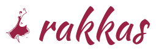

# Rakkas

---

**DO NOT USE IN PRODUCTION! This project is still in early exploratory phase. It's not even alpha quality.**

---



**Rakkas** aims to be a [React](https://reactjs.org) framework powered by [Vite](https://vitejs.dev), with a developer experience inspired by [Next.js](https://nextjs.org) and [Svelte Kit](https://kit.svelte.dev).

**Rakkas** [ɾɑkːˈɑs] is an old Turkish word borrowed from Arabic, meaning dancer. The now obsolete second meaning is pendulum.

## Getting started
To start a new project, type the following commands on the command line and then follow the prompts.

```sh
mkdir my-rakkas-project
cd my-rakkas-project
npm init @rakkasjs
```

If you prefer to start from scratch, add `@rakkasjs/cli` as a dev dependency and `@rakkajs/core`, `react` and `react-dom` as a dependency.


## TODO
- Router and useRakkas
- Documentation
- Prepare packages for publication
- Project initializer
- MVP!

- Data caching and SWR
- HTTPS mode for dev server
- Separate API and pages dirs
- Data caching
- Page transition animations
- Investigate renderToNodeStream
- Localized routing
- Customized routing
- Adapters for serverless environments

## Credits and license
- Initial concept and programming by [Fatih Aygün](https://github.com/cyco130)
- Logomark: “Flamenco” by [gzz from Noun Project](https://thenounproject.com/term/flamenco/111303/) (not affiliated). Used under [Creative Commons Attribution Generic license (CCBY)](https://creativecommons.org/licenses/by/2.0/).
